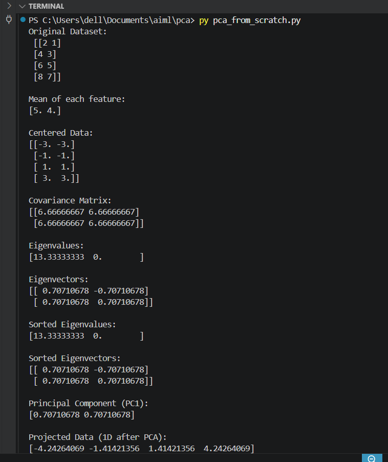
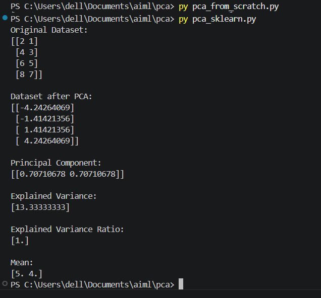

# Principal Component Analysis (PCA)

## 📌 Overview

This project demonstrates **Principal Component Analysis (PCA)**, an **unsupervised machine learning algorithm** used for **dimensionality reduction**. PCA transforms the original features into a smaller set of new features called **Principal Components**, while preserving as much information (variance) as possible.

---

## 🧮 PCA From Scratch (NumPy)

The manual implementation performs the following steps:

1. Calculate the mean of each feature.
2. Center the data.
3. Compute the covariance matrix.
4. Calculate eigenvalues and eigenvectors.
5. Sort eigenvalues and eigenvectors.
6. Select the principal component.
7. Project the data onto the principal component.

---

## 🤖 PCA Using Scikit-learn

The Scikit-learn implementation performs the complete PCA workflow using the `PCA` class.

Key methods and attributes used:

* `PCA(n_components=1)`
* `fit_transform()`
* `components_`
* `explained_variance_`
* `explained_variance_ratio_`
* `mean_`

---

## 📊 Dataset

```
X = [
    [2, 1],
    [4, 3],
    [6, 5],
    [8, 7]
]
```

---

## 📷 Output

### NumPy Implementation



### Scikit-learn Implementation



---


## ✅ Conclusion

This project demonstrates both the mathematical foundation and the practical implementation of PCA. The NumPy implementation provides an understanding of the algorithm's internal working, while the Scikit-learn implementation shows how PCA is applied efficiently in real-world machine learning workflows.
